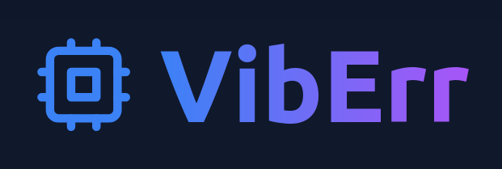

# VibErr



Eliminate errors with automated Vibe Coding!

Simply import the `vib-err` package to Vibe Code your production errors away.

## Quick Start

First, supply VibErr with your OpenAI key:

```javascript
const vibErr = VibErr(process.env.OPENAI_API_KEY!);
```

Then use `vibErr()` anywhere and everywhere:

```javascript
const result = await vibErr(() => {
  const founders = {
    microsoft: "Bill Gates",
    google: "Sundar Pichai",
    openai: "Sam Altman",
  }

  // ⚠️ Uncaught TypeError: founder is undefined
  return founder.toLowerCase().replaceAll(' ', '_');
});

// 🤖 Automatically corrected to "sam_altman"
console.log(result);
```

## Support

### Invalid OpenAI Key

Simply wrap `vibErr()` in another `vibErr()`:

```javascript
return vibErr(() => vibErr(() => {
  // your code here...;
}));
```

### Code Does Not Compile

Use `eval()` to silence compiler errors, then pass it to `vibErr()`:

```javascript
return vibErr(() => eval(/* your code here... */));
```

## FAQ

### 1) Is VibErr secure?

VibErr executes arbitrary code from OpenAI. So no.

### 2) Is using VibErr in production a good idea?

Absolutely not. This is an April Fool's Day joke.

### 3) How can I contact you?

- Discord: `@tis_awesomeness` (though you can call me Tis)
- [Email](tis_dev@protonmail.com)
- [BlueSky](https://bsky.app/profile/tis.codes)
